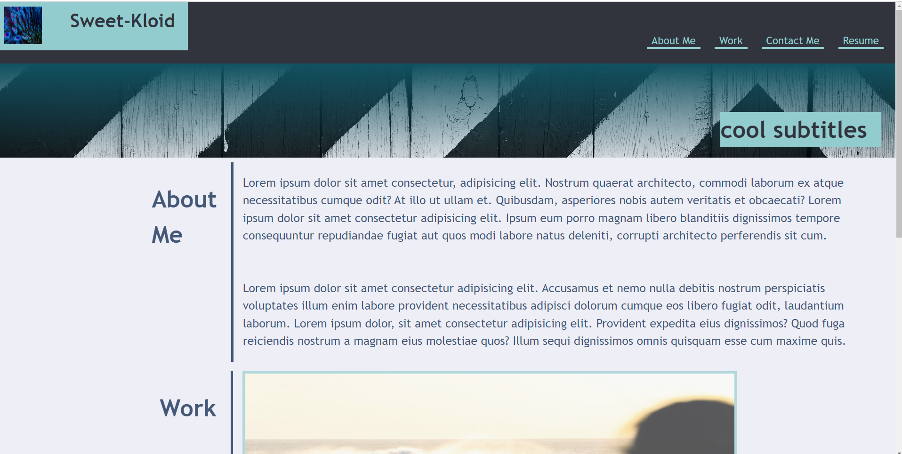
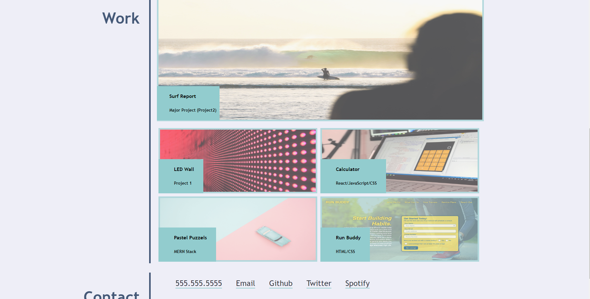

# Sweet-Kloid
challenge 2

## Description:

Given the instuctions we built a webpage from scratch using HTML and CSS. We started off with having the name and links for the information that was to follow. So if a user clicks on the links it scrolls to the corresponding section automatically. With the navbar links we wanted to add some hover decorations to make it interactive so the user knows where they are and where they are clicking. The next thing we needed to do was set up the header to have a cool background image. We then wanted to created the body. The body has images that like to more information about the employee. This images also had a hover added to them so that the user knows where they are and what they are clicking.Finally, we wanted to apply flex properties and media queries so that when the webpage changes in size the webpage looks clean at anysize.

## Usage

Linked here is the URL that take you to the Github repo for this webpage: https://sweetkloid.github.io/Sweet-Kloid/.

Here is a demo of functionality: 

## Credits

Thanks to bootcamp classmates, instructor, and TA's. They helped make this project possible.

## License

none